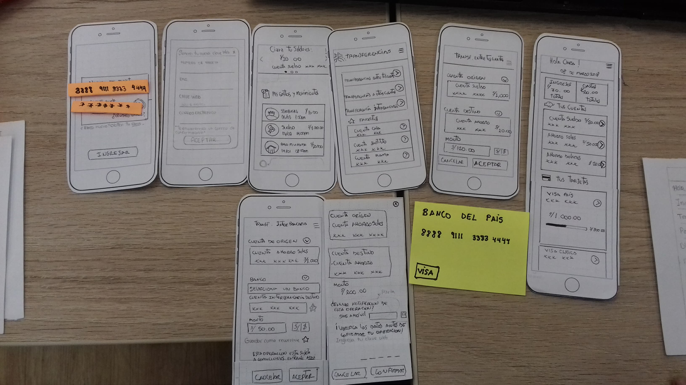
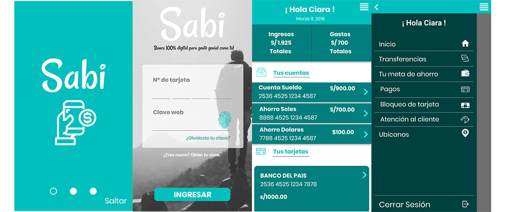
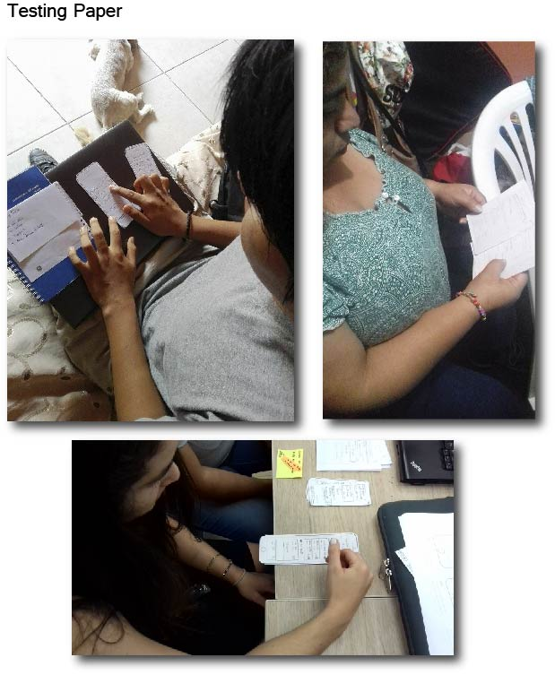

# Banco Millennial

Nuestro cliente el Banco del País es una institución de muchos años y actualmente está pasando por un proceso de transformación digital. Como parte de este proceso, han implementado un área de innovación que quiere llegar de una mejor manera a los usuarios más jóvenes. Por lo que, inspirados en Nequi, Nubank y Simple nació SABI una banca 100% digital dirigido para millennials, [conócela](https://marvelapp.com/628i8jb) !  

  

## Desarrollado para 
[Laboratoria](http://laboratoria.la)
___

### Introducción:

Los millennials al ser una población aproximada del 70%, con la caracteristica de ser personas que se pueden adaptar facilmente a los cambios. Es una generación que se caracteriza por la hiperconexión, la necesidad de auto expresarse, la realidad financiera, el interés por la salud, la inmediatez y la búsqueda de experiencias entre otras cosas.

### Objetivo:

Crear una banca 100% digital para los millennials, que sea de fácil acceso, que se adapte a cualquier necesidad, con un buen soporte de ayuda al usuario, que les brinde confianza y que sea de utilidad. Una app / web más personalizada que le permita al usuario realizar cualquier tipo de consulta y trámite bancario en menos tiempo sin colas ni confusiones.

[Link de la presentación](https://docs.google.com/presentation/d/1IidnhES_ktjlBexaw6KgnrKLCoHs6xrZquP4pc6_9g4/edit#slide=id.p3)

### SkateHolders del proyecto:

* **Gerente de Marketing**: Desarrollar e implementar las mejoras estrategias de marketing a corto y largo plazo.
* **Community Manager**: Actúa como auditor de la marca en las redes sociales.
* **Reguladores SBS**: Regulación y supervisión del sistema financiero a implementar en la web.
* **Gerente IT**: Manejará la plataforma tecnológica para mejorar o innovar procesos.
* **Gerente de riesgos**: Propondrá estrategias para la identificación tanto de los riesgos  económicos  |internos como los externos.
* **CEO**: Dirección administrativa de la organización.
* **UX Designer**:Resolverá las necesidades de los usuarios, consiguiendo la mayor satisfacción y mejor experiencia.
* **Visual Design**: Diseñará la plataforma web con contenido que sea atractivo para los Millennials.
* **Front-End**: Se encarga de realizar la interfaz de la página de tal manera que pueda quedar cómoda para los usuarios.
* **Back-End**: Se encargara de interactuar y verificar las bases de datos.

### Reunión Kick-off

* Conocer a los principales Stakeholders.
* Realizar una planificación de las ideas que se van a ejecutar.
* Ver las funcionalidades que tendra la Web/App.
* Conocer de forma detallada los objetivos sobre el proyecto.
* Plantear preguntas o temas para la investigación de mercado.
* Plantear un posible diseño de la Web/App
* Revisar la viabilidad del proyecto(proceso del banco, regularizaciones SBS).
* Recoger los datos para ser pasados a una plataforma digital.

### Skateholders presentes en la reunión & preguntas a realizar.

* **UX Designer**: ¿Qué procesos realizará para crear una we que cubra todas las necesidades del usuario?¿Qué metodología utilizará para crear la Web/App con contenido útil y de lenguaje amigalbe para los millennials?
* **CEO**: ¿Cual es el propósito principal de proyecto realizado?¿Qué expectativas tiene del proyecto a realizar?
* **Reguladores SBS**: ¿Es viable realiza transacciones via web?¿Qué vunelrabilidades puede tener el usuario?
* **Gerente de IT**: ¿En que situaciones podemos contar con su soporte tecnológico?¿Porqué se está haciendo el proyecto?¿Qué busca resolver?

### Business Model Canvas

### Plan de propuesta de investigación

* **Data Analítica**: Realización de investigación sobre el porcentaje de uso de aplicaciones móviles en ámbito bancario, etc.
* **Análisis de mercado**: Realización del estudio de mercado de las competencias y tener dato de como funcionan cada una de ellas.
* **Entrevistas a Usuarios**: Realización de entrevistas con usuarios dentro del rango que buscamos acaparar (millennial).
* **Entrevistas a Expertos**: Realización de entrevistas con respecto a empresas o aplicaciones similares.
* **Ideación del producto y prototipado**: Con lo obtenido, se empieza la creación del producto con lo datos recabados.
* **Testeo y Realización de producto**: Se realiza un testeo con lo usuarios sobre la nueva propuesta del banco digital y con los feedbacks recibidos se prototipa.  
## PROCESO  

### Guía de entrevista para usuarios 
[Link del archivo de guía](https://docs.google.com/document/d/1Q53O030YK2eXA-HvkJxDAnTNqPbEHFnSbx-wbpYsNMY/edit)  
### Resumen de las entrevistas realizadas:
Decidimos realizar entrevistas presenciales para centrarnos en el lenguaje corporal.   
-  75% visita las oficinas una o ninguna vez al mes.  
-  Desean una estrategia digital clara.  
-  Por ejemplo, compartir una opinión de una experiencia que han tenido, o dejarse guiar por las opiniones del resto de usuarios. Son más colectivos, viven en un mundo donde se comparte el conocimiento”.  
-  Buscan independizarse, viajar, pasárselo bien.  
-  Son muy exigentes en cómo empresas y bancos se acercan a ellos. Dan un minuto a una aplicación móvil para que les satisfaga. Si no, la borrarán para siempre.  
-  No quieren una relación autoritaria como hasta ahora, en la que el banco dice cómo se tienen que hacer las cosas.  
-  El 41% de los encuestados afirma que elegía su banco por el mejor uso de su aplicación móvil.  

### User Persona:
En base a las respuestas de los usuarios se decidió realizar un User Persona.

### Analisis de las respuestas y Card Sorting:
Analisis de las respuestas de los entrevistados y realización del proceso de Card Sorting para la separación de las necesidades que debemos cubrir para los usuarios.

### Benchmarking:  
  

En busca de las mejores practicas para ser implantadas encontramos las siguientes empresas:  
#### **Simple**
Simple es un banco que inspira confianza, tienen una buena estructura de información y se centran directamente en las necesidades habituales de los usuarios.  
#### **Interbank**
La aplicación de Interbank te permite realizar operaciones de una manera fácil, rápida y segura. Esta App se centran en brindar seguridad a los usuarios.  
#### **Bcp-Yape**
Yape es un app que tiene un diseño juvenil y un lenguaje amigable.

### Feature list:

Características de nuestro producto digital priorizadas según la necesidad de nuestro usuario.
- Consultas (Saldos, últimos movimientos de cuentas (donde ha realizado un pago) y cuentas (crédito y débito)).
- Transferencias (Entre tus cuentas, a otras cuentas, interbancarias).
- Tus metas de ahorro.
- Pagos (agua luz, Recarga de celular, pagos a instituciones).
- Bloqueo de tarjeta.
- Atención al cliente (comunícate con nosotros, video llamada, mensajes, reclamos).
- Ubícanos (cajeros y agentes).

### Content Prototyping: [Clic para visualizar](https://docs.google.com/document/d/1E3DhWLPYFCzkVqU-p-hPOvgaTQXgfrDRwTpYEi9H1Eg/edit)
### Protipo:

* **Paper prototype**

* **Prototype Digital**: [Demo completa](https://marvelapp.com/628i8jb)

### Testing y feedback:

### Miembros:
* [Alejandra Hoces](https://github.com/alejandraHoces)
* [Daniela Centeno](https://github.com/DDCenteno)
